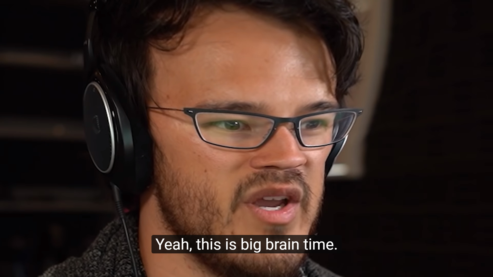

# Past Projects

## PTEC (2019 - 2020)
Messing around with HTML and CSS
- [Messing around with HTML](https://liam-lee-66.github.io/html-components/)
- [Messing around with HTML 2](https://liam-lee-66.github.io/Website-making/)
- [First Final Project (CyberLife website)](https://liam-lee-66.github.io/CyberLife-Website-After-edit-Mark-booster-/index.html)
- [Second Final Project (Recreating Memory Express website)](https://liam-lee-66.github.io/MemoryExpress-Website/)

## MITT (2021 - PRESENT)
### Intro to Web Development (2021)
Starting to focus into CSS styling
- [Assignment 3](https://liam-lee-66.github.io/itwd/Lee_Liam_Assignment_3/index.html)
- [Assignment 4](https://liam-lee-66.github.io/itwd/Lee_Liam_Assignment_4/index.html)
- [Assignment 5](https://liam-lee-66.github.io/itwd/Lee_Liam_Assignment_5/index.html)
- [Assignment 6 (Lemons)](https://liam-lee-66.github.io/itwd/Lee_Liam_Assignment_6/index.html)
    - First time making a 'full' webpage
- [Final Project (Personal Website)](https://liam-lee-66.github.io/itwd/Final_Project/index.html)
    - Tried altering colour schemes
    - Replaced Lorum Ipsum with personal info
    - Created new pages
        - All of the links in headers actually work!

### Technical Writing (2021)
- [Final Project (Personal Website)](https://github.com/Liam-Lee-66/SD160-Techinical-Writing-Skills---Final-Project-Portofolio)
    - Altered colour scheme to look more professional
    - Focused on displaying long/huge paragraphs 
    - Messed around with shadows for elements

### Intro to JavaScript / JavaScript Basics (2021)
First time implementing JS into HTML and CSS
- [Project_1 (Celsius, Fahrenheit converter)](https://liam-lee-66.github.io/jsb/Project-1/index.html)
- [Project_2 (Calculator)](https://liam-lee-66.github.io/jsb/Project-2/index.html)
    - Tried messing around with gradient colour scheme
- [Final_Project](https://liam-lee-66.github.io/jsb/Final-project/index.html)
    - Focused in login system
        - ID: ciscoadmin
        - PW: cisco123

### Object Oriented JavaScript (2022)
[Link to project folder](https://github.com/Liam-Lee-66/liam-lee-66.github.io/tree/main/oojs)
- [Review (Shape Dispenser)](https://liam-lee-66.github.io/oojs/Liam_Lee_oojs_review/index.html)
    - Tried out dark themed colour scheme
- [Project 2 (Fakebook)](https://liam-lee-66.github.io/oojs/Liam_Lee_oojs_project_2/index.html)
- [Exercise 2 (Birthday Checker)](https://liam-lee-66.github.io/oojs/Liam_Lee_oojs_exercise_2/index.html)
- [Assignment 1 (What's OOJS?)](https://liam-lee-66.github.io/oojs/Liam_Lee_oojs_assignment_1/index.html)
    - Tried messing around with purple colour schemes
        - That was a mistake
- [Assignment 2 (Alarm)](https://liam-lee-66.github.io/oojs/Liam_Lee_oojs_assignment_2/index.html)
    - Focused on glossy effect
- [Assignment 3 (Keep Contacts)](https://liam-lee-66.github.io/oojs/Liam_Lee_oojs_assignment_3/index.html)
    - More dark themed colour schemes
- [Clickity-click-gmae](https://liam-lee-66.github.io/Clickity-click-gmae/)
    - Tried new colour scheme
        - That was also a mistake

### Intro to 3rd Party API (2022)
- [Assignment 1 (The boring website)](https://liam-lee-66.github.io/itpa/Liam_Lee_itpa_assignment_1/index.html)
    - Messing around with cookies
- [Assignment 3 (Tracking You)](https://liam-lee-66.github.io/itpa/Liam_Lee_itpa_assignment_3/index.html)
- [Final Project (Fakebook 2.0)](https://liam-lee-66.github.io/itpa/Final_Project/index.html)

### Tools and Automation (2022)
- [Web Portofolio](https://liam-lee-66.github.io/WebDevPortofolio/index.html)
    - Tried JS animations
- [Github README Profile](https://github.com/Liam-Lee-66/Liam-Lee-66)
- [Dialog Tutorial](https://github.com/Liam-Lee-66/dialogTutorial)
- [Dev Team Project (Car Blog)](https://zack-z23.github.io/Dev-Team/)
    - First Group Project
        - So many errors
    - Group Project Members:
        - Jacob Block
        - Liam Lee
        - Zacharias Zachariadis

### Object-Oriented Fundamentals C# (2023)
- [Final Project (C# Game)](https://github.com/Liam-Lee-66/liam-lee-66.github.io/tree/main/oofc%23/OOP%20Fundementals%20Final%20Project)